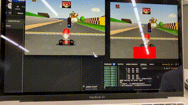

<div>



# AndyNet64

Reinforcement learning for Mario Kart 64

</div>

## Running the project

The easiest way to run the project is with [docker-compose](https://docs.docker.com/compose/). Simply run
```sh
docker-compose up --build -d
```

A container with a vncserver will be bound to `localhost:5900`. You can use a vncserver like [TigerVNC](https://tigervnc.org/) to watch the agent train.

